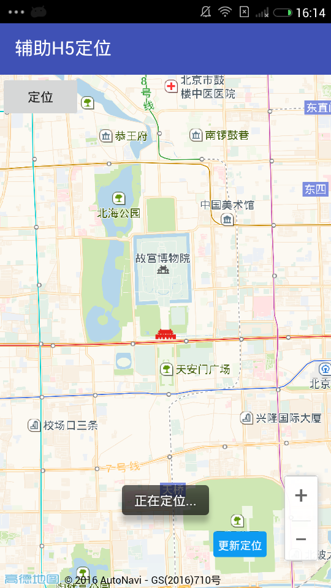
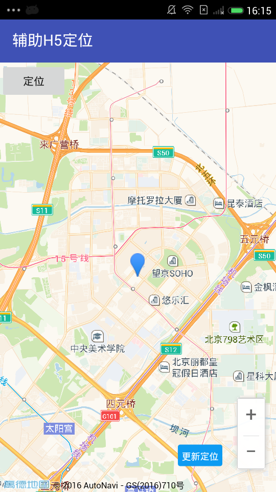

# android-assist-h5-location
辅助H5定位：
Javascript-Api实现H5页面的App，当页面需要使用位置时可以选择使用定位 SDK 辅助提供位置信息。

## 前述 ##
- [高德官网申请Key](http://lbs.amap.com/dev/#/).
- 阅读[参考手册](http://a.amap.com/lbs/static/unzip/Android_Map_Doc/index.html).
- 工程基于高德地图Android定位SDK及JavaScript API实现

## 使用方法##
###1:配置搭建AndroidSDK工程###
- [Android Studio工程搭建方法](http://lbs.amap.com/api/android-sdk/guide/creat-project/android-studio-creat-project/#add-jars).
- [通过maven库引入SDK方法](http://lbsbbs.amap.com/forum.php?mod=viewthread&tid=18786).

## 截图##

## 扫一扫安装##

